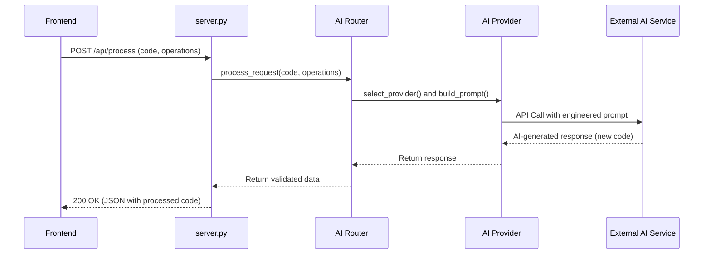

# piracyShield - AI-Powered Code Optimizer & Securizer


An intelligent platform designed to analyze, optimize, and secure your code using a powerful backend powered by multiple AI providers, all managed through a sleek, modern web interface.

---

## Table of Contents

- [About The Project](#about-the-project)
- [Screenshot](#screenshot)
- [Key Features](#key-features)
- [Tech Stack](#tech-stack)
- [Getting Started](#getting-started)
  - [Prerequisites](#prerequisites)
  - [Installation (Docker - Recommended)](#installation-docker---recommended)
  - [Manual Installation](#manual-installation)
- [Technical Documentation & Workflow](#technical-documentation--workflow)
  - [High-Level Architecture](#high-level-architecture)
  - [Backend Workflow (API Request Lifecycle)](#backend-workflow-api-request-lifecycle)
  - [Frontend Workflow (User Interaction)](#frontend-workflow-user-interaction)
  - [Docker Configuration](#docker-configuration)
- [Project Structure](#project-structure)
- [Contributing](#contributing)
- [License](#license)
- [Contact](#contact)

---

## About The Project

**piracyShield** is a full-stack application built to streamline the process of code enhancement. The backend, built with Python, serves as an intelligent router to various Large Language Models (LLMs) like Gemini, OpenAI, and Anthropic. It takes a piece of code as input and performs several key actions:

-   **Optimization:** Rewrites the code for better performance and readability.
-   **Security Wrapping:** Analyzes the code for potential vulnerabilities and wraps it in security checks.
-   **Automated Documentation:** Generates clear, concise documentation for the code's functionality.

The frontend is a modern, responsive web application built with Next.js and TypeScript, providing a user-friendly interface to interact with the powerful backend services. The entire application is containerized with Docker, allowing for a seamless setup and deployment experience.

---

## Screenshot

*Add a screenshot of your application's main interface here to give visitors a quick look at your work.*


---

## Key Features

-   :robot: **Multi-Provider AI Backend:** Intelligently routes requests to the best AI provider (Gemini, OpenAI, Anthropic, etc.) for the task.
-   :zap: **Code Optimization:** Improves code efficiency, style, and performance.
-   :lock: **Security Analysis:** Identifies potential security flaws and applies fixes.
-   :books: **Auto-Documentation:** Generates markdown documentation from your source code.
-   :art: **Sleek Web UI:** A clean and intuitive interface built with Next.js and Tailwind CSS.
-   :whale: **Containerized:** Easy one-command setup and deployment with Docker Compose.

---

## Tech Stack

This project is a monorepo composed of two main services:

| Backend                               | Frontend                                |
| ------------------------------------- | --------------------------------------- |
|      |      |
|  (or FastAPI) |            |
|      |  |
|                                       |  |

---

## Getting Started

You can get the project running on your local machine in two ways: using Docker (recommended for ease of use) or a manual setup (for development).

### Prerequisites

-   **Docker & Docker Compose:** [Install Docker Desktop](https://www.docker.com/products/docker-desktop/)
-   **Node.js & npm:** [Install Node.js](https://nodejs.org/) (for manual frontend setup)
-   **Python & pip:** [Install Python](https://www.python.org/downloads/) (for manual backend setup)

### Installation (Docker - Recommended)

This is the simplest way to get both the frontend and backend running together.

1.  **Clone the repository:**
    ```bash
    git clone [https://github.com/Arunmadhavan28/0pirate.git](https://github.com/Arunmadhavan28/0pirate.git)
    cd 0pirate
    ```

2.  **Configure Environment Variables:**
    The project uses a `.env.example` file to define the necessary environment variables (like your AI API keys).
    ```bash
    # Create a .env file from the example
    cp .env.example .env
    ```
    Now, open the `.env` file and add your secret API keys.

3.  **Build and Run with Docker Compose:**
    This single command will build the Docker images for the frontend and backend, and start both services.
    ```bash
    docker-compose up --build
    ```

4.  **You're ready!**
    -   The frontend will be accessible at [http://localhost:3000](http://localhost:3000)
    -   The backend API will be running on [http://localhost:5000](http://localhost:5000) (or the port you configured)

### Manual Installation
<details>
<summary><strong>Expand for Manual Setup Instructions</strong></summary>

**Backend Setup**
```bash
# Navigate to the backend directory
cd backend

# Create and activate a virtual environment
python -m venv venv
source venv/bin/activate
# On Windows, use: venv\Scripts\activate

# Install dependencies
pip install -r requirements.txt

# (If needed) Create a .env file here with backend-specific keys
# ...

# Run the backend server
python server.py
```

**Frontend Setup**
```bash
# Navigate to the frontend directory
cd frontend

# Install dependencies
npm install

# Create a local environment file for Next.js
cp .env.example .env.local

# Add your frontend-specific API keys to .env.local
# ...

# Run the development server
npm run dev
```
</details>

---

## Technical Documentation & Workflow

### High-Level Architecture

The system is designed as a classic client-server model, containerized for portability and scalability. The user interacts with the Next.js frontend, which makes API calls to the Python backend. The backend then orchestrates requests to external AI services before returning the processed data.

```mermaid
graph TD
    A[User] -->|Interacts with UI| B(Frontend: Next.js on Port 3000);
    B -->|API Request (JSON)| C(Backend: Python on Port 5000);
    C -->|Selects & Calls Provider| D(AI Provider Router);
    D --> E[OpenAI API];
    D --> F[Google Gemini API];
    D --> G[Anthropic Claude API];
    subgraph External Services
        E
        F
        G
    end
```

### Backend Workflow (API Request Lifecycle)

When the backend receives a request (e.g., to `/api/process`), it follows a specific sequence of steps to process the code.

1.  **API Endpoint Hit:** The `server.py` receives a `POST` request containing the user's code and a list of desired operations (e.g., `['optimize', 'secure']`).
2.  **Parsing & Preparation:** The input code is sanitized and prepared for processing by the `parser.py` module.
3.  **AI Provider Routing:** The core logic in `src/providers/router.py` selects the most appropriate AI model. This decision can be based on the task type, model cost, or availability.
4.  **Prompt Engineering:** For each operation, a specialized module (e.g., `optimizer.py`, `secure_wrapper.py`) constructs a detailed prompt tailored for the selected AI model.
5.  **API Call:** The relevant provider module (e.g., `gemini_provider.py`) handles the authenticated API call to the external AI service.
6.  **Validation & Response:** The response from the AI is received. The `validator.py` module may perform checks to ensure the generated code is syntactically correct.
7.  **JSON Serialization:** The final, processed data (optimized code, security report, documentation) is packaged into a JSON object and sent back to the frontend.



### Frontend Workflow (User Interaction)

1.  **State Management:** The user's input code and selected options are stored in the React component's state (e.g., using `useState`).
2.  **API Request:** On submission, an asynchronous function is called. It uses `fetch` to send a `POST` request to the backend's API endpoint (`http://localhost:5000/api/process`). A loading state is set to `true`.
3.  **Data Fetching:** The frontend awaits the JSON response from the backend.
4.  **UI Update:** Upon receiving the data, the loading state is set to `false`, and the response data (optimized code, etc.) is stored in state. This triggers a re-render of the component, displaying the results in the appropriate output sections.

### Docker Configuration

The `docker-compose.yml` file is the key to the containerized setup.
-   It defines two main services: `backend` and `frontend`.
-   It builds the `backend` service using its `Dockerfile`, exposing its port (e.g., 5000).
-   It builds the `frontend` service using its `Dockerfile`, exposing its port (e.g., 3000).
-   It sets up a shared network, allowing the frontend container to communicate with the backend container using its service name (e.g., `http://backend:5000`).
-   It injects the environment variables from the root `.env` file into the respective containers, providing the necessary API keys securely.

---

## Project Structure

The repository is structured as a monorepo with separate concerns for the backend and frontend.

```
/
├── backend/
│   ├── src/             # Core Python application logic, AI providers
│   ├── data/            # Sample input/output files
│   ├── server.py        # Main server entrypoint (e.g., Flask, FastAPI)
│   └── requirements.txt # Python dependencies
│
├── frontend/
│   ├── src/             # Next.js application source code (pages, components)
│   ├── public/          # Static assets (images, svgs)
│   ├── package.json     # Node.js dependencies
│   └── tsconfig.json    # TypeScript configuration
│
├── .gitignore           # Root gitignore
├── docker-compose.yml   # Docker service definitions
└── README.md            # You are here!
```

---

## Contributing

Contributions are what make the open-source community such an amazing place to learn, inspire, and create. Any contributions you make are **greatly appreciated**.

1.  Fork the Project
2.  Create your Feature Branch (`git checkout -b feature/AmazingFeature`)
3.  Commit your Changes (`git commit -m 'Add some AmazingFeature'`)
4.  Push to the Branch (`git push origin feature/AmazingFeature`)
5.  Open a Pull Request

---

## License

Distributed under the MIT License. See `LICENSE` file for more information.

---

## Contact

Arunmadhavan EVR - [@Arunmadhavan28](https://github.com/Arunmadhavan28)

Project Link: [https://github.com/Arunmadhavan28/0pirate](https://github.com/Arunmadhavan28/0pirate)