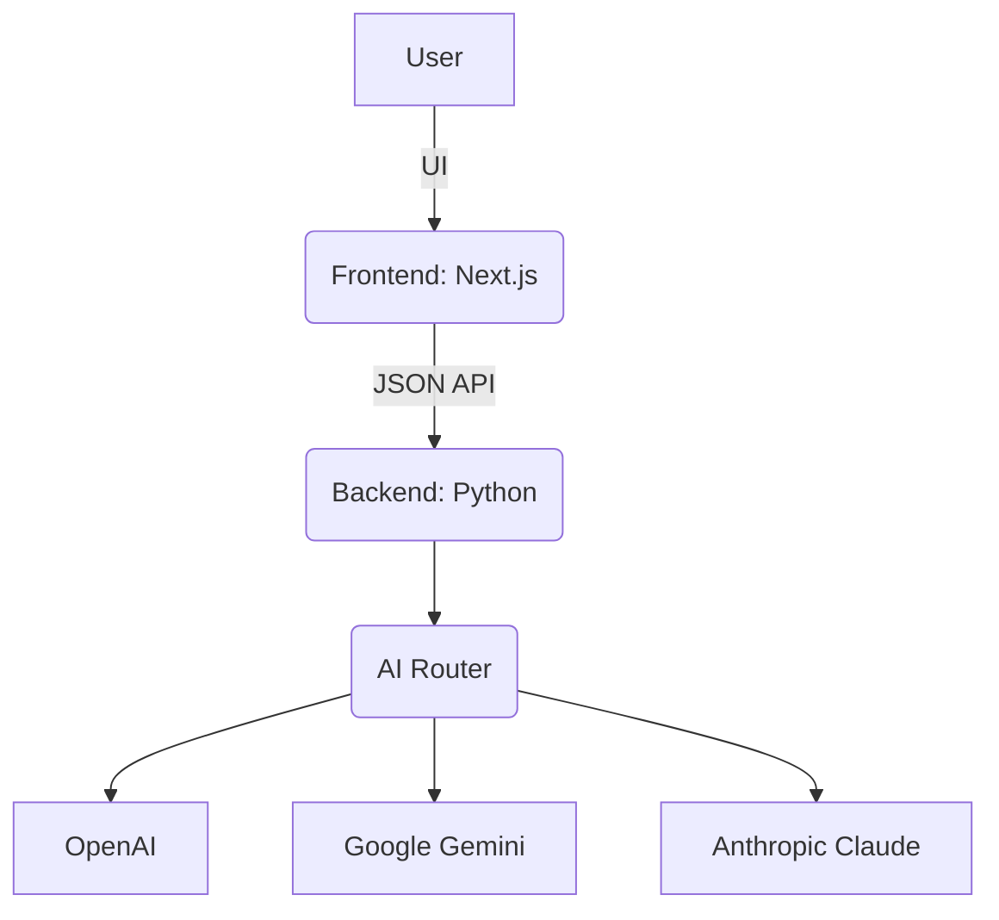

# 0Pirate - AI-Powered Code Optimizer & Securizer


An intelligent platform designed to analyze, optimize, and secure your code using a powerful backend powered by multiple AI providers, all managed through a sleek, modern web interface.

---

## Table of Contents

* [About The Project](#about-the-project)
* [Screenshot](#screenshot)
* [Key Features](#key-features)
* [Tech Stack](#tech-stack)
* [Getting Started](#getting-started)

  * [Prerequisites](#prerequisites)
  * [Installation (Docker - Recommended)](#installation-docker---recommended)
  * [Manual Installation](#manual-installation)
* [Technical Documentation & Workflow](#technical-documentation--workflow)

  * [High-Level Architecture](#high-level-architecture)
  * [Backend Workflow (API Request Lifecycle)](#backend-workflow-api-request-lifecycle)
  * [Frontend Workflow (User Interaction)](#frontend-workflow-user-interaction)
  * [Docker Configuration](#docker-configuration)
* [The Journey of Your Code: The 0Pirate Pipeline](#the-journey-of-your-code-the-0pirate-pipeline)
* [Your Control Panel: Max Security & Token Saver](#your-control-panel-max-security-and-token-saver-explained)
* [Live Example: Max Security in Action](#a-live-example-max-security-in-action)
* [The 0Pirate Edge](#the-0pirate-edge-your-position-in-the-market)
* [Project Structure](#project-structure)
* [Contributing](#contributing)
* [License](#license)
* [Contact](#contact)

---

## About The Project

**0Pirate** is a full-stack application built to streamline the process of code enhancement. The backend, built with Python, serves as an intelligent router to various Large Language Models (LLMs) like Gemini, OpenAI, and Anthropic. It takes a piece of code as input and performs several key actions:

* **Optimization:** Rewrites the code for better performance and readability.
* **Security Wrapping:** Analyzes the code for potential vulnerabilities and wraps it in security checks.
* **Automated Documentation:** Generates clear, concise documentation for the code's functionality.

The frontend is a modern, responsive web application built with Next.js and TypeScript, providing a user-friendly interface to interact with the powerful backend services. The entire application is containerized with Docker, allowing for a seamless setup and deployment experience.

---

## Screenshot

*Add a screenshot of your application's main interface here to give visitors a quick look at your work.*


---

## Key Features

* \:robot: **Multi-Provider AI Backend** – Routes requests to the best AI provider (Gemini, OpenAI, Anthropic, etc.)
* \:zap: **Code Optimization** – Improves code efficiency, style, and performance.
* \:lock: **Security Analysis** – Identifies vulnerabilities and applies fixes.
* \:books: **Auto-Documentation** – Generates markdown documentation from source code.
* \:art: **Sleek Web UI** – Built with Next.js and Tailwind CSS.
* \:whale: **Containerized** – One-command setup and deployment with Docker Compose.

---

## Tech Stack

| Backend                                                                                                           | Frontend                                                                                                                  |
| ----------------------------------------------------------------------------------------------------------------- | ------------------------------------------------------------------------------------------------------------------------- |
|            |               |
|  (or FastAPI) |                      |
|            |        |
|                                                                                                                   |  |

---

## Getting Started

You can run the project in two ways: **Docker (recommended)** or **manual setup**.

### Prerequisites

* [Docker Desktop](https://www.docker.com/products/docker-desktop/)
* [Node.js](https://nodejs.org/)
* [Python](https://www.python.org/downloads/)

### Installation (Docker - Recommended)

```bash
git clone https://github.com/Arunmadhavan28/0pirate.git
cd 0pirate

# Configure environment variables
touch .env
# (copy from .env.example and add API keys)

# Build & run services
docker-compose up --build
```

Frontend → [http://localhost:3000](http://localhost:3000)
Backend → [http://localhost:5000](http://localhost:5000)

### Manual Installation

<details>
<summary>Backend Setup</summary>

```bash
cd backend
python -m venv venv
source venv/bin/activate
pip install -r requirements.txt
python server.py
```

</details>

<details>
<summary>Frontend Setup</summary>

```bash
cd frontend
npm install
cp .env.example .env.local
npm run dev
```

</details>

---

## Technical Documentation & Workflow

### High-Level Architecture



### Backend Workflow

1. API request received.
2. Code sanitized by `parser.py`.
3. AI provider selected by `router.py`.
4. Specialized prompt built.
5. AI response validated.
6. JSON returned to frontend.

### Frontend Workflow

1. Input stored in state.
2. Request sent via `fetch`.
3. Await response.
4. UI updates with optimized/secured code.

### Docker Configuration

* Services: `backend`, `frontend`.
* Shared network for container communication.
* Env variables injected via `.env`.

---

## The Journey of Your Code: The 0Pirate Pipeline

1. **Submission & Pre-Checks:** Code uploaded and validated.
2. **Secret Redaction:** API keys, tokens → replaced with `<SECRET_1>`.
3. **Prompt Engineering:** Builds context-aware prompt for AI.
4. **Secure LLM Processing:** AI analyzes, optimizes, and fixes bugs.
5. **Verification & Restoration:** Secrets restored, sandbox tests run.
6. **Result:** Clean, secure, optimized code returned.

---

## Your Control Panel: Max Security and Token Saver Explained

### **Max Security (Toggle ON)**

* Obfuscates identifiers & strings → AI sees only structure, not logic.
* Protects business logic and IP.

### **Token Saver (Toggle ON)**

* Returns only diffs instead of full code.
* Saves LLM token costs.
* Easier developer review.

---

## A Live Example: Max Security in Action

### Bugged Code

```python
# api_client.py
import requests
API_KEY = "sk-abc123xyz-this-is-a-real-secret"

def get_user_data(user_id: int):
    url = "https://api.example.com/users?id=%s&key=%s" % user_id, API_KEY
    response = requests.get(url)
    return response.json()
```

### Walkthrough A: Max Security OFF

* AI sees readable code (with secrets redacted).
* Fix applied directly.
* Secrets restored → working code.

### Walkthrough B: Max Security ON

* Code abstracted → identifiers obfuscated.
* AI fixes structural bug without knowing logic.
* Backend restores real identifiers & secrets.
* Same working result, **with full IP protection**.

---

## The 0Pirate Edge: Your Position in the Market

| Feature                             | **0Pirate** | **Copilot / CodeWhisperer** |
| ----------------------------------- | ----------- | --------------------------- |
| **Secret Redaction**                | ✅ Yes       | ❌ No                        |
| **Code Abstraction (Max Security)** | ✅ Yes       | ❌ No                        |
| **Diff Output (Token Saver)**       | ✅ Yes       | ❌ No                        |
| **Multi-Provider Backend**          | ✅ Yes       | ❌ Limited                   |
| **Containerized Setup**             | ✅ Yes       | ❌ No                        |

---

## Project Structure

```
/
├── backend/
│   ├── src/             # Core Python logic, AI providers
│   ├── data/            # Sample input/output
│   ├── server.py        # Entrypoint (Flask/FastAPI)
│   └── requirements.txt
│
├── frontend/
│   ├── src/             # Next.js pages & components
│   ├── public/          # Static assets
│   ├── package.json
│   └── tsconfig.json
│
├── docker-compose.yml
└── README.md
```

---

## Contributing

1. Fork the repo
2. Create a branch (`git checkout -b feature/xyz`)
3. Commit (`git commit -m 'Add xyz'`)
4. Push (`git push origin feature/xyz`)
5. Open a PR

---

## License

Distributed under the MIT License. See `LICENSE` file for details.

---

## Contact

**Author:** Arunmadhavan EVR
**GitHub:** [@Arunmadhavan28](https://github.com/Arunmadhavan28)
**Project Link:** [0Pirate Repo](https://github.com/Arunmadhavan28/0pirate)
